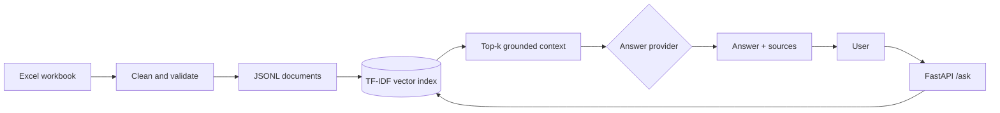

# NP Employee Assistant

A compact retrieval-augmented question-answering service over the supplied employee workbook.
It preprocesses 10,018 employee records, retrieves relevant evidence from a local vector index,
and returns grounded answers with source records through FastAPI.

## What is included

- Excel schema validation, cleaning, deduplication, and ISO date normalization
- Inspectable JSONL processed data
- TF-IDF word/bigram embeddings and a persisted Joblib vector index
- Cosine-similarity top-k retrieval with a relevance threshold
- Three answer providers: credential-free extractive mode, OpenAI-compatible LLM, or Ollama
- `POST /ask` and `GET /health`, validation, error handling, Swagger documentation
- Unit/API tests and a labeled retrieval evaluation script
- Docker configuration, architecture notes, and a PDF design report

## Architecture



More detail is in [docs/architecture.md](docs/architecture.md).

## Quick start (Windows PowerShell)

```powershell
py -m venv .venv
.venv\Scripts\Activate.ps1
python -m pip install -r requirements-dev.txt
python -m scripts.ingest
.\.venv\Scripts\python.exe -m uvicorn app.main:app --reload
```

Open `http://127.0.0.1:8000/docs` for interactive Swagger documentation.

On macOS/Linux, activate with `source .venv/bin/activate`; the other commands are unchanged.

## Ask a question

```powershell
Invoke-RestMethod -Method Post -Uri http://127.0.0.1:8000/ask `
  -ContentType 'application/json' `
  -Body '{"question":"Which software engineers work in IT?","top_k":3}'
```

Example response shape:

```json
{
  "question": "Which software engineers work in IT?",
  "answer": "I found the following relevant employee information: ...",
  "sources": [
    {"employee_id": "EMP0000004", "full_name": "Nicholas Valdez", "score": 0.31, "text": "..."}
  ],
  "provider": "extractive"
}
```

## Full generative RAG

The default `extractive` provider needs no key and never invents facts. To use an
OpenAI-compatible LLM, copy `.env.example` to `.env` and set:

```dotenv
LLM_PROVIDER=openai
OPENAI_API_KEY=your-key-here
OPENAI_MODEL=gpt-4o-mini
```

Never commit `.env`; it is ignored by Git. For a local model, install Ollama, pull the model,
and configure:

```dotenv
LLM_PROVIDER=ollama
OLLAMA_MODEL=llama3.2:3b
```

The API endpoint is always local FastAPI. These provider settings only control the answer
generator behind it.

## Test and evaluate

```powershell
pytest -q
python -m scripts.evaluate
```

The evaluation reports Precision@5 and Mean Reciprocal Rank across representative department
and job-title queries. This is a baseline retrieval evaluation, not a substitute for a curated
human-labeled question set.

## Docker

```powershell
docker compose up --build
```

The supplied computer does not currently have Docker installed, but the configuration is ready
for any Docker-capable environment.

## Project structure

```text
app/                    FastAPI, ingestion, retrieval, and generator code
scripts/                Ingestion, evaluation, and report generation
tests/                  Unit and API tests
docs/                   Architecture and assessment report
data/processed/         Generated JSONL (not committed)
artifacts/              Generated vector index (not committed)
employee_np.xlsx        Supplied source dataset
```

## Design boundaries

This prototype is strongest at record lookup questions. Exact organization-wide counts, sums,
and averages should use a governed structured query tool rather than estimating from retrieved
rows. Production recommendations—including dense embeddings, hybrid retrieval, access control,
deployment, and monitoring—are covered in [the report](docs/report.md).
