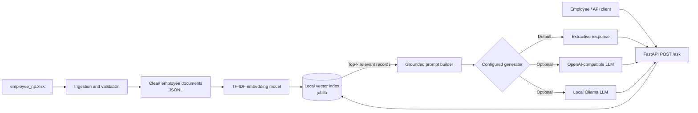

# Architecture

## Request lifecycle

1. At startup, the workbook is validated, duplicates are removed, types are normalized,
   and each employee row becomes one self-contained text document.
2. TF-IDF converts the documents to sparse vectors. The fitted vectorizer, matrix, and
   source metadata are persisted locally with Joblib.
3. `POST /ask` validates the question and converts it with the same vectorizer.
4. Cosine similarity selects the most relevant records. Low-scoring records are removed.
5. The selected records are sent to the configured answer generator. The prompt requires
   answers to use only retrieved context. The API returns both the answer and sources.

The default extractive generator makes the repository runnable without secrets. Setting
`LLM_PROVIDER=openai` or `LLM_PROVIDER=ollama` activates the generative stage of RAG.

